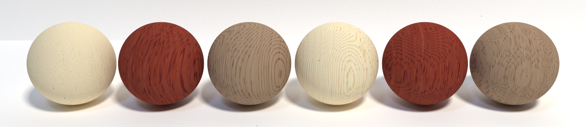
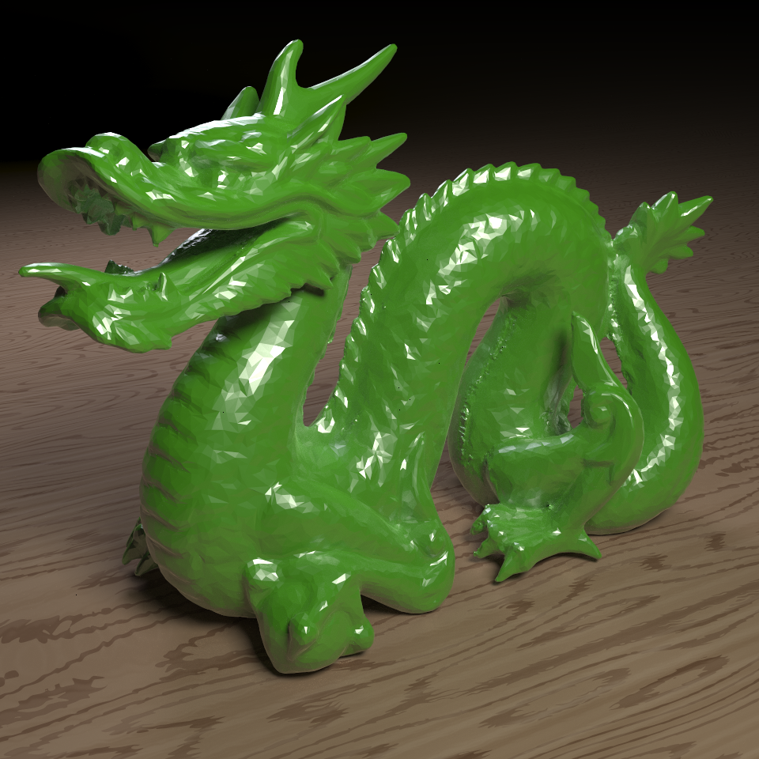
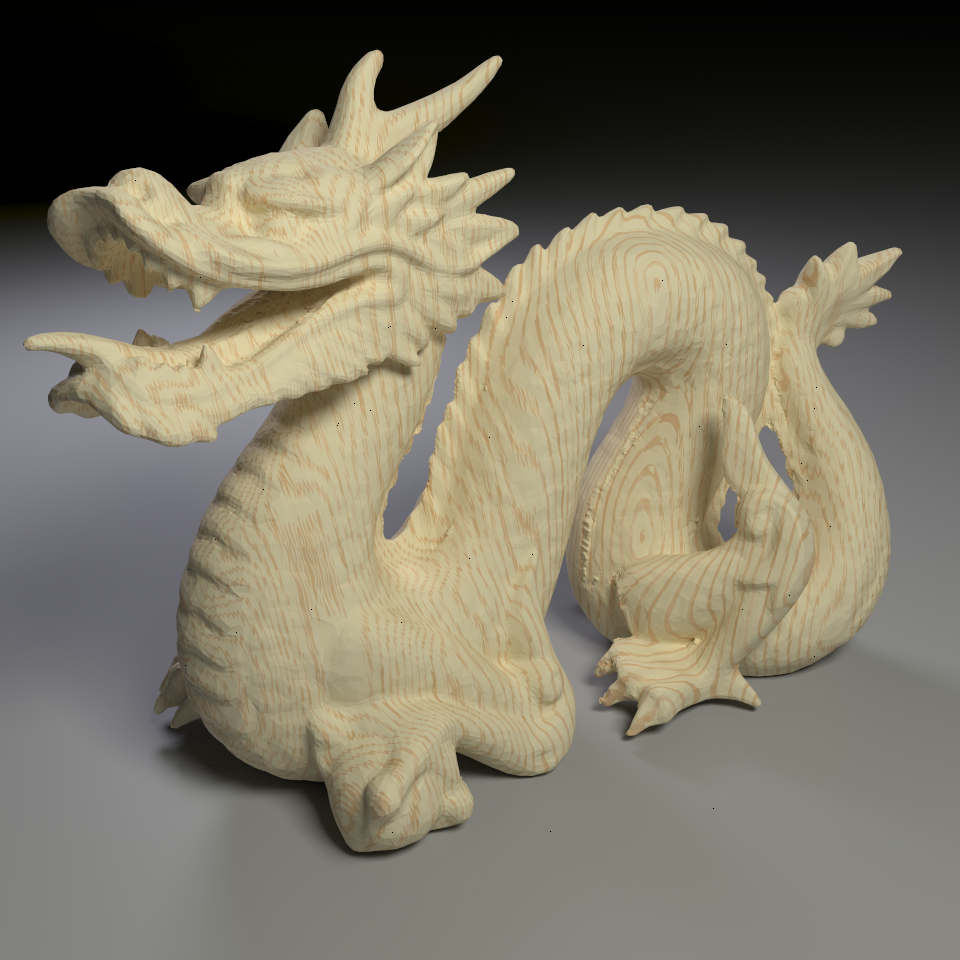

# CSE 168 Final Project
# Tobey Pineda

CSE 168 Final Project

I implemented a procedural wood material based on the research paper:
https://www.cs.cornell.edu/projects/wood/simulating_the_structure_and_texture_of_solid_wood.pdf

Basic Growth rings were implemented with a square wave as a function of the radius from the origin
of the wood grain and a user defined grain width.

Color was defined with a Beer's Law Curve, along with a Perlin Noise function, allowing the growth rings
to naturally fluctuate colors.
	Futhermore both growth rings and color were further modulated with Perlin Noise to reduce the regularity
of the pattern and increase realism.

Distortion and fiber direction was implemented with a texture map that is rotated about the "cylinder" of
wood. Values are fetched from the texture map as a function of the radius and "height" of the object. 

Usage:
    wood [on/off]		
    woodtype [oak/mahogany/walnut]
	woodtypeman earlywoodcolor.x earlywoodcolor.y earlywoodcolor.z latewoodcolor.x latewoodcolor.y latewoodcolor.z
	wooddim origin.x origin.y origin.z direction.x direction.y direction.z witdth

Images:

ggx.test displays the 3 different types of wood built into the program: oak, mahogany, and walnut.
The left 3 spheres display the same grain direction, while the right 3 spheres display varying grain direction.

dragon.test displays the use of the wood material as a wall or floor material.

dragon2.test displays the use of the wood material on a complex, high polygon-count object.

# Raytracer w/ Optix - Simulating Wood
### UCSD CSE 168, Spring 2021

---

### The Raytracer:
This raytracer makes use of state of the art techniques and algorithms including real-time ray and path tracing in OptiX, and a modern path tracer with multiple importance sampling.

For the final project, implemented a procedural wood material based on the research paper:
https://www.cs.cornell.edu/projects/wood/simulating_the_structure_and_texture_of_solid_wood.pdf

---

### Direct Lighting

|Analytic|9 Samples|3x3 Subdivided|Multiple   Light Sources|Cornell Box|
|:-:|:-:|:-:|:-:|:-:|
|  |   |  | | |

### Indirect Lighting - Different Sampling Methods
	
|Simple Sampling|Cosine Sampling|Nearest Event   Estimation Sampling|Round Robin   Sampling|BRDF Sampling|
|:-:|:-:|:-:|:-:|:-:|
|  |  |   | |  |

### Importance Sampling
	
|Multiple Importance Sampling|GGX BRDF|Final Dragon|
|:-:|:-:|:-:|
|  |  |   |
#### Design Team:
- Figma

#### Development Team:
- Mapbox
- Glitch
- HTML
- CSS
- JavaScript

#### Data:
- Spreadsheets to input and manage case studies

#### Design Requirements:
- Discoverability
- Desirability
- Simplicity
- Ease of Maintenance

---
